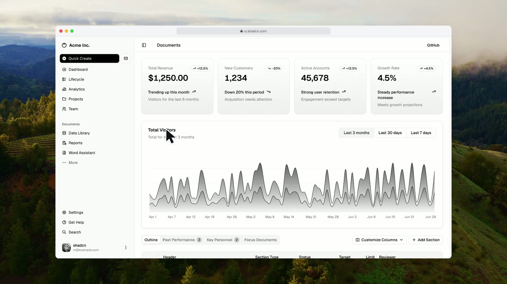

# Agent Screen

Ferramenta local para agentes gravarem demonstrações de aplicações web com zoom animado, cursor suave e composição de vídeo. Primeira versão funcional: uma CLI, uma skill e um exemplo completo. A referência visual é o Screen Studio; este projeto não é afiliado a ele e ainda não oferece paridade com o editor.

## Exemplo

[](docs/media/web-dashboard.mp4)

Clique na imagem para ver o vídeo (27 s, 1080p, 60 fps). Foi gravado sem edição a partir de [examples/web-dashboard.json](examples/web-dashboard.json), no [dashboard de exemplo do shadcn/ui](https://ui.shadcn.com/view/new-york-v4/dashboard-01): o agente troca o período do gráfico, seleciona uma linha, edita uma meta, abre o painel de detalhes e esconde uma coluna. Zoom, cursor, ritmo e fundo (Sonoma Horizon) são os padrões da ferramenta.

## Experimentar

Requer Node.js 22+, FFmpeg no PATH e Chromium do Playwright.

```sh
npm ci
npx playwright install chromium
npm run demo
```

O exemplo abre uma aplicação fictícia local, edita o nome de um projeto e mostra o resultado. [examples/web-dashboard.json](examples/web-dashboard.json) grava um app real na web, o dashboard de exemplo do shadcn/ui: muda o período do gráfico, edita uma linha da tabela, abre o painel de detalhes e esconde uma coluna. Tudo acontece localmente no navegador, mas o exemplo depende de o site estar no ar e de os rótulos não mudarem. O MP4 fica em `recordings/demo/video.mp4`. Use uma pasta nova ao repetir a gravação:

```sh
node src/cli.mjs record examples/demo.json --out recordings/minha-demo
```

Instalar a skill no Codex:

```sh
node scripts/install-skill.mjs
```

O instalador cria um link para `skills/agent-screen` em `$CODEX_HOME/skills` (ou `~/.codex/skills`). A pasta deste projeto precisa permanecer disponível. Ele não substitui uma skill existente. A skill pode ser invocada como `$agent-screen` quando o ambiente recarregar a lista de skills.

## Roteiros para agentes

O agente inspeciona a aplicação, identifica os seletores e escreve um JSON como [examples/demo.json](examples/demo.json). A CLI executa o roteiro em um contexto Chromium isolado. Não usa outro modelo de IA, conta de serviço ou upload.

```json
{
  "url": "http://localhost:3000",
  "viewport": { "width": 1440, "height": 810 },
  "steps": [
    { "action": "click", "selector": "#edit", "pause": 1 },
    { "action": "type", "selector": "#title", "text": "Novo título" },
    { "action": "click", "selector": "#save", "expect": "#saved-message" },
    { "action": "focus", "selector": "#updated-title", "duration": 1.5 }
  ]
}
```

| Ação | Parâmetros | Comportamento |
| --- | --- | --- |
| `click` | `selector` | Move o cursor como uma pessoa que mira, clica e espera a interface assentar |
| `type` | `selector`, `text` | Foca o campo, limpa o conteúdo existente e digita em ritmo humano; evita reclicar no campo já focado |
| `focus` | `selector`, `duration` | Enquadra um elemento sem clicar; regiões altas são lidas a partir do topo |
| `scroll` | `y`, `duration` | Rolagem relativa em pixels: sai rápido e desliza até parar |
| `press` | `key` | Atalho ou tecla no elemento atualmente focado; combinações com modificador aparecem no vídeo |
| `wait` | `duration` | Pausa em segundos |

Cada passo aceita `pause` (segundos após a ação) e `expect` (seletor que deve ficar visível). Sem `pause`, a captura escolhe o ritmo: depois de cliques e teclas espera animações e mudanças do DOM terminarem (até 0,6 s) e registra a área da página que mudou; em seguida vem um respiro curto e variável, como o de uma pessoa, e não uma batida fixa. Um resultado de `expect` fica em tela por 0,6 s + 0,15 s por palavra do seu título (0,8–1,6 s), tempo de registrar a mudança sem ler o painel inteiro; se o passo seguinte age dentro do resultado, a pausa é curta. A câmera enquadra o resultado junto com o controle clicado quando ambos cabem, ou vai até ele; um resultado grande (página, diálogo) é mostrado na visão geral. `expect` não verifica texto nem conclusão de requisições: selecione um indicador real de sucesso. Seletores ambíguos, elementos ausentes e expectativas não satisfeitas interrompem a gravação. O manifesto registra o erro e a exportação recusa sessões incompletas.

O viewport padrão é 1440×810 (16:9, como a exportação), para a janela ficar com margens uniformes. `file:./demo.html` é resolvido relativamente ao arquivo JSON. Para uma aplicação autenticada, `--storage-state /caminho/session.auth.json` carrega um estado Playwright existente. `--headed` abre o navegador com interface.

## Acabamento e exportação

```sh
# Capturar sem compor
node src/cli.mjs record roteiro.json --out recordings/entrega --capture-only

# Prévia leve
node src/cli.mjs render recordings/entrega --width 1280 --height 720

# Reexportar a mesma captura, sem repetir as ações
node src/cli.mjs render recordings/entrega --preset midnight --zoom 2 --window none
```

| Opção | Padrão | Faixa |
| --- | --- | --- |
| `--width`, `--height` | 1920 × 1080 | 320–3840, dimensões pares |
| `--fps` | 60 | 24–60, inteiro |
| `--zoom` | 1.5 | 1–3; nível dos close-ups; 1 desliga o zoom |
| `--blur` | 0.75 | 0–1; 0 desliga motion blur |
| `--cursor-size` | 2 | 0.5–4 |
| `--padding` | 0.09 | 0–0.25 |
| `--preset` | sonoma-horizon (macos sem wallpapers importados) | macos, dusk, midnight, pearl e os wallpapers importados (`tahoe-day`, `sonoma-horizon`, `big-sur`…) |
| `--window` | browser | browser (barra com semáforos e endereço), none |
| `--keys` | combos | combos (atalhos e teclas nomeadas como Esc, Enter, Tab), all, none |
| `--pacing` | balanced | balanced (acelera tempo morto), original |
| `--quality` | high | high (CRF 16), standard (CRF 18) |
| `--output` | `<gravação>/video.mp4` | Caminho alternativo de saída |

O zoom serve para detalhe local. Um clique cujo efeito ocupa a tela (o gráfico redesenha, um painel abre, uma coluna some) acontece na visão geral, sem aproximar no controle só para afastar em seguida. Digitação, menus e efeitos pequenos ganham close-up. Ações locais próximas no tempo (até 3 s entre elas) formam uma única tomada com nível de zoom constante. A câmera se move junto com a mão: zoom e pans começam quando o cursor parte em direção ao alvo, e o cursor pode andar livremente pelos 60% centrais do quadro antes de a câmera acompanhá-lo. Assim o cursor nunca é arrastado pela tela depois de parar, e um zoom-out que terminaria logo antes de o cursor sair acontece junto com a saída dele. O zoom permanece por 1,8 s após o último clique ou 1,2 s após a digitação. Tomadas separadas por menos de 1,5 s se conectam com um pan, sem voltar à visão geral; entre close-ups até 2,5 s separados em assuntos próximos, a câmera recua só até a metade do zoom e volta, em vez de ir à visão geral; tomadas curtas demais são descartadas em vez de piscar. Scroll manual encerra a tomada; o auto-scroll até o próximo alvo não. Um `focus` grande demais para ampliar e um resultado grande (diálogo, página nova) seguram a visão geral entre as tomadas. O vídeo sempre abre na página inteira: um `focus` antes do primeiro gesto não dá zoom, e a primeira aproximação acontece junto com o primeiro movimento do mouse. Se a tomada seguinte enquadra o próprio resultado revelado (por exemplo, um `focus` nele até 3,5 s depois), a câmera vai direto do close-up para ela, sem passar pela visão geral. Quando a região inteira de uma tomada cabe no quadro, o enquadramento fica parado; caso contrário, a câmera acompanha cada alvo. Em campos largos, enquadra o início do texto e segue o caret. O nível padrão é 1.5×, reduzido apenas quando a região não cabe com margem; um contêiner próximo e compacto é incluído quando disponível.

A câmera usa duas molas criticamente amortecidas em cascata sobre zoom (em escala logarítmica) e pan: sai sem tranco, chega a 90% em ~0,6 s e assenta em ~1,2 s, como o zoom do Screen Studio. A velocidade da mola principal acompanha o tempo até a próxima mudança: até 1,5× mais rápida quando a próxima ação é iminente, 0,8× antes de uma pausa longa, para os movimentos não terem todos a mesma duração. Partindo da visão geral, o zoom cresce direto em direção ao alvo; ao sair, recua a partir do mesmo enquadramento. No fim, o vídeo espera o último zoom-out assentar (1,2 s) e fica mais 0,4 s parado. Perto das bordas, como no Screen Studio, a câmera pode mostrar o wallpaper, limitada à cena com margem e a cerca de 10% do quadro nos close-ups.

O cursor é redesenhado a partir dos dados da captura:

- **Suavização:** como no Screen Studio, o cursor é desenhado através de uma mola (rigidez 470, amortecimento 70, massa 3, o padrão do Screen Studio) que persegue a mão um pouco à frente: começa suave, arredonda as curvas e assenta ao chegar, sem atraso perceptível. Perto de cada clique ele é preso ao ponto exato, como no Cap e no openscreen.
- **Trajetória:** arco visível (4–7% da distância no ponto mais largo) sempre para o mesmo lado, com curvatura e forma variando a cada gesto, pico de velocidade antes da metade e desaceleração longa. Só alvos pequenos (< 24 px) recebem a correção final, de no máximo 120 ms; alvos maiores são atingidos num traço só.
- **Duração:** segue a lei de Fitts para um apresentador ágil, com variação lognormal entre gestos e velocidade máxima legível. A trajetória é gravada com o tempo planejado: uma página ocupada não estica o traço na tela.
- **Pausas:** o cursor fica parado enquanto o resultado aparece, como numa gravação real. Quando o próximo alvo já está na tela e há tempo, a mão vai até ele num único traço durante a pausa e espera em cima dele; a câmera sai junto com esse traço. Nada de deslizes lentos, avanço em duas etapas ou tremor aleatório.
- **Clique:** a espera antes de clicar varia como a de uma pessoa (mais longa em alvos pequenos e antes de salvar, excluir ou confirmar). O ponteiro encolhe para 0,8× nos 130 ms antes do botão descer, fica pressionado no máximo 0,14 s e volta com um leve rebote (1,04×).
- **Troca de forma:** entre seta, mão e I-beam, a nova forma surge com crossfade e escala de 0,2 s.
- **Rotação:** o ponteiro inclina 1° a cada 480 px/s de velocidade horizontal, até 8°.
- **Visibilidade:** some ao começar a digitação, como no macOS, e reaparece 250 ms antes de voltar a se mover. Também encolhe e some após 3,5 s parado (nunca durante um scroll), ou logo antes de a câmera se mover sozinha e arrastar o cursor parado por mais de 1/16 da largura do quadro, ou para fora dele (um `focus` longe do ponteiro, o zoom-out de um resultado). Os fades levam ~0,2 s com easing. Ocultações com menos de 0,5 s são puladas para o cursor não piscar, e um cursor que sumiria antes do primeiro movimento não aparece na abertura.
- **Tamanho:** cresce levemente com o zoom.

Antes de digitar, a mão leva 0,25–0,45 s para ir do mouse ao teclado; um campo já preenchido é selecionado (o destaque aparece por ~0,2 s) e sobrescrito. A digitação tem intervalos lognormais em torno de 100 palavras por minuto, primeira tecla de cada palavra mais lenta, pausas após vírgula e ponto e hesitações ocasionais no meio da palavra. Atalhos com modificador (por exemplo `ControlOrMeta+K`) e teclas nomeadas que mudam a página por si só (Esc, Enter, Tab) aparecem numa pílula escura na parte inferior do vídeo; um Esc ou Enter isolado não esconde o cursor. O auto-scroll desliza o alvo, e o próximo alvo quando cabe junto, até pouco acima do meio da tela, em vez de colá-lo na borda.

O motion blur integra amostras temporais do movimento da câmera e do cursor, espaçadas em no máximo ~2 px (até 16 por frame em `high`). A página é rasterizada uma vez por frame, e as amostras de blur reutilizam essa imagem com um pequeno deslocamento; ele não aplica um desfoque uniforme à tela. Novas capturas usam PNG sem perdas e `captureScale: 2`: viewport de 1440×810 produz frames de 2880×1620, sem mudar o layout da página. O Chromium usa escala física e emulada compatíveis, verificadas em cada frame. O zoom amostra a imagem original diretamente; evita reduzir a página antes de ampliá-la. Use `captureScale: 3` no roteiro para exportações 4K com mais reserva de resolução, respeitando o limite de 8192 pixels por dimensão.

O fundo padrão é o Sonoma Horizon (colinas de Sonoma ao entardecer), disponível depois de `npm run wallpapers`; sem wallpapers importados, usa o wallpaper do macOS fornecido pelo usuário, salvo em `assets/macos-wallpaper.png` (preset `macos`). A imagem preenche a saída sem distorção, com recorte central quando necessário. Os presets de gradiente continuam disponíveis. A janela tem uma barra de navegador vetorial (semáforos e endereço, sem query string), com tom claro ou escuro conforme o topo da página, e se destaca do fundo só pela sombra em três camadas, sem contorno, como no Screen Studio: nenhum fundo escuro fica sob a janela, então a borda suavizada da página se mistura direto com o wallpaper. Wallpaper, margem, janela, página e cursor formam uma única cena: na visão geral a margem aparece ao redor da tela e, durante o zoom, a cena inteira aumenta e se move continuamente com a câmera. O wallpaper pode continuar visível nas bordas quando o enquadramento pedir isso, evitando mudanças bruscas de posição durante a animação. No ritmo `balanced`, trechos em que nada muda na tela (sem gesto, clique, tecla ou scroll, e sem repaint visível; um cursor de texto piscando ou um spinner pequeno não contam) e que passam de 1,1 s mantêm 0,35 s de quietude em cada ponta e passam o meio 3,5× mais rápido; um `focus` explícito mantém 1,8 s de leitura. A gravação começa depois que a página para de animar, com o cursor num ponto que não abre tooltip nem hover. A saída é H.264/MP4, com fast-start para reprodução na web. O arquivo é marcado como 1-13-1 (primárias e matriz BT.709, transferência sRGB), no bitstream e no átomo `colr`, para o QuickTime e o Safari não clarearem as cores.

Mais fundos: `npm run wallpapers` converte os wallpapers do macOS instalados neste Mac (e um quadro dos wallpapers em vídeo, como o Tahoe) para JPEG 4K em `assets/wallpapers/`; `node scripts/import-wallpapers.mjs --download` também baixa os que o macOS só baixa sob demanda (Big Sur, Catalina, Chroma, Dome, Peak, Hello…), do mesmo catálogo oficial que os Ajustes do Sistema usam (~1,5 GB, com cache em `~/Library/Caches/agent-screen`). Cada arquivo vira um preset pelo nome (`--preset tahoe-day`). A pasta fica fora do git: os wallpapers são da Apple, licenciados com o Mac, e não devem ser redistribuídos.

## Arquivos de uma sessão

- `frames/*.png`: frames originais sem perdas em alta densidade; sessões antigas com JPEG continuam renderizáveis.
- `timeline.json`: timestamps, posições do cursor, cliques, regiões de foco e status.
- `video.mp4`: vídeo composto.
- `poster.png`: frame do meio da exportação para inspeção rápida.
- `camera.json`: trajetória da câmera para diagnóstico.
- `render.json`: parâmetros e medições reais de tempo de exportação e memória amostrada do processo Node. `motion` resume o movimento para ajuste objetivo: tomadas, fração do vídeo com zoom, menor close-up, menor retorno à visão geral (valores baixos indicam "pumping"), focos ignorados e fps da captura durante scroll.

O arquivo do vídeo só é substituído após uma exportação bem-sucedida. Re-renderizar pode alterar o vídeo e os arquivos de diagnóstico da sessão. O roteiro contém os textos digitados; o manifesto não os duplica, mas os frames naturalmente mostram o conteúdo visível da página.

## Arquitetura e dependências

```text
Roteiro do agente → Playwright / Chromium → PNGs + eventos com timestamps
                                              ↓
                              Câmera + composição Skia → FFmpeg → MP4
```

O código é separado pela responsabilidade de cada etapa:

```text
src/
├── cli.mjs                 entrada da CLI
├── cli/options.mjs         parsing e normalização de flags
├── capture/
│   ├── record.mjs          orquestra a sessão de gravação
│   ├── actions.mjs         executa passos e movimento do cursor
│   ├── pacing.mjs          tempos de pausas, deslocamento e digitação
│   ├── page-state.mjs      inspeção do DOM, auto-scroll e posição do caret
│   └── screencast.mjs      captura, verifica resolução e persiste frames do CDP
├── render/
│   ├── index.mjs           orquestra a exportação frame a frame
│   ├── background.mjs      wallpaper, gradientes e sombra da janela
│   ├── toolbar.mjs         barra do navegador: tom e desenho
│   ├── scene.mjs           composição direta da fonte e transformação da cena
│   ├── cursor-art.mjs      vetores do cursor
│   ├── cursor.mjs          forma, visibilidade, inclinação e clique por frame
│   ├── keys.mjs            pílula de atalhos
│   ├── focus.mjs           planejamento das tomadas de zoom
│   ├── tracks.mjs          câmera e cursor de cada frame, simulados antes da composição
│   ├── metrics.mjs         métricas de movimento do `render.json`
│   ├── pacing.mjs          compressão temporal de esperas com rampas suaves
│   ├── encoder.mjs         processo e lifecycle do FFmpeg
│   └── settings.mjs        defaults e validação de render
├── motion.mjs              câmera, easing e trajetória do cursor
└── plan.mjs                validação do roteiro
```

`src/record.mjs` e `src/render.mjs` continuam como fachadas públicas para manter imports existentes estáveis.

- [Playwright](https://playwright.dev/): ações, seletores e controle do Chromium.
- [Chrome DevTools Protocol](https://chromedevtools.github.io/devtools-protocol/tot/Page/#method-startScreencast): frames com timestamp do compositor, sem polling de screenshots para o vídeo.
- [@napi-rs/canvas](https://github.com/Brooooooklyn/canvas): composição nativa com Skia.
- [FFmpeg](https://ffmpeg.org/): codificação H.264 e mux do MP4.

A captura e a renderização são sequenciais e independentes. O renderizador mantém somente o frame fonte atual e buffers de composição, aplica amostragem adaptativa e respeita a vazão do encoder. Os metadados de câmera são proporcionais à duração; os frames originais ficam em disco. A memória reportada não inclui processos Chromium nem FFmpeg.

Referências analisadas: [Screen Studio — animações](https://screen.studio/guide/animations), [cursor](https://screen.studio/guide/cursor), [auto zoom](https://screen.studio/guide/auto-zoom), [Recordly](https://github.com/webadderallorg/Recordly) e [OpenScreen](https://github.com/siddharthvaddem/openscreen). Os dois últimos são aplicações de edição completas; nenhum código ou asset deles foi incorporado. A implementação utiliza as bibliotecas listadas acima e mantém a lógica específica de roteiro e enquadramento neste projeto.

## Limites desta versão

- Grava roteiros executados pela própria CLI em uma única aba Chromium; não grava o histórico do trabalho nem se conecta à aba que outro agente já está usando.
- A câmera e o cursor são renderizados a 60 fps por padrão. A captura da interface segue o ritmo do compositor do navegador; 60 fps na saída não garante 60 frames distintos da aplicação por segundo.
- Sem captura de áudio, webcam, janelas nativas, popups, drag-and-drop ou edição visual de timeline.
- A rolagem da página é capturada como ocorre; o blur temporal implementado trata câmera e cursor, sem sintetizar frames intermediários da interface.
- Alterar a proporção da saída mantém a proporção da captura e adiciona margem; ainda não há recomposição automática para redes sociais verticais.
- Usa Skia e libx264 em CPU. Aceleração GPU e encoder de hardware ainda precisam de implementação e benchmark.
- Novas capturas registram seta, mão e I-beam conforme o DOM. Não há captura de cursores personalizados de canvas/iframes; sessões antigas usam seta.

## Verificação

```sh
npm test
npm run check
```

Os testes cobrem geometria e estabilidade da câmera, trajetória e interpolação do cursor e validação do roteiro. O exemplo local exercita captura, digitação, cliques, resultado final, composição e codificação. A revisão visual do MP4 continua necessária: esses testes não medem beleza nem demonstram equivalência ao Screen Studio.

## Caminho rápido para agentes

A skill reaproveita URL, seletores e estado conhecidos da tarefa. A preparação deve investigar apenas o que falta para o roteiro; não exige auditoria do projeto, reinstalação, ensaio completo ou exportação de prévia. O comando `record` já verifica as dependências antes das ações e entrega o MP4 numa única execução. O padrão continua 1080p/60 fps.

```sh
# Diagnóstico opcional: informa o repositório da ferramenta e correções necessárias
node src/cli.mjs doctor
# Validação opcional, sem navegador; não verifica seletores na aplicação
node src/cli.mjs validate examples/demo.json
```

Help e validação carregam apenas módulos necessários e funcionam sem Canvas, Chromium ou FFmpeg instalados. Instale dependências no repositório da ferramenta, nunca no projeto filmado por engano. O runner da skill funciona a partir de outro diretório usando caminhos absolutos.

`workflow.json` registra preflight, setup do navegador, gravação, exportação e total da CLI. Setup é parte do tempo de gravação, não deve ser somado novamente. A preparação do agente antes da chamada não é medida. Os tempos da CLI aparecem também no JSON final. Falhas de exportação indicam como reaproveitar a captura com `render`.

A câmera intersecta regiões de foco com o viewport antes de enquadrá-las. Contêineres maiores que a área visível são centralizados quando não cabem na região de conforto. A posição animada usa o espaço disponível no zoom atual, sem cortar a posição depois da mola; isso evita saltos ao sair de um close-up nas bordas. Essa correção também se aplica a capturas existentes via `render`.

Após um clique, o zoom volta à visão geral no tempo normal mesmo se a aplicação ainda estiver carregando. `focus` manual respeita sua duração. Em capturas antigas, o fim real da digitação pode não estar separado da espera por resultado.

O cursor usa interpolação cúbica monotônica entre amostras: preserva posições e horários de clique sem overshoot nem atraso de um filtro.

## Demonstração longa

`examples/extended-demo.html` é um workspace fictício local com formulário, menus, checklist, notas, gráfico e relatório. `examples/extended-demo.json` executa 38 ações, incluindo rolagem, foco em regiões amplas, teclas, digitação longa e carregamentos simulados. Não acessa serviços externos.

```sh
node src/cli.mjs record examples/extended-demo.json --out recordings/extended-demo
```

Use uma pasta nova ao repetir. Os carregamentos deliberados permitem avaliar o recuo do zoom após inatividade; as regiões amplas exercitam legibilidade e redução automática de ampliação.

## Qualidade atual (2026-09-15)

O padrão `high` usa fonte PNG em 2×, composição direta, até 16 amostras temporais e H.264 CRF 16. A conversão usa matriz BT.709 com transferência sRGB identificada no arquivo. As alternativas de encoder medidas estão em [docs/motion-review.md](docs/motion-review.md). `standard` usa CRF 18 e até cinco amostras, preservando a fonte capturada. O render informa a resolução fonte e a reserva de pixels no maior zoom; valores abaixo de 1 significam ampliação de pixels existentes.

Grupos compactos compartilham escala e região de enquadramento. Scrolls encerram focos antigos e a câmera abre antes da rolagem; a próxima aproximação aguarda o alvo estar disponível. A rolagem agenda eventos conforme o tempo real e descarta atrasos, mantendo a duração solicitada. A digitação varia nos limites de palavras e pontuação.

Esperas longas usam rampas contínuas de velocidade, limitadas a 4×, mantendo 550 ms em velocidade real nas bordas. Movimentos, cliques e scrolls protegidos não são comprimidos. `pause` e `focus` explícitos continuam disponíveis para leitura. [Mapa das melhorias, referências e limites](docs/quality-review.md).

As revisões anteriores estão no [histórico técnico](docs/history.md).
